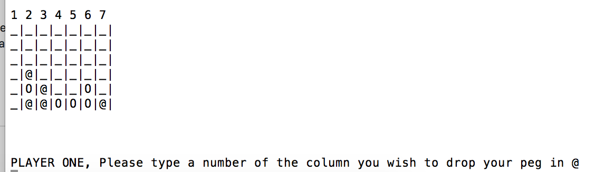

#  Connect Four Game with AI, tested in RSpec in Object Oriented Ruby

Connect Four (also known as Captain's Mistress, Four Up, Plot Four, Find Four, Fourplay[citation needed], Four in a Row, Four in a Line and Gravitrips (in Soviet Union)) is a two-player connection game in which the players first choose a color and then take turns dropping colored discs from the top into a seven-column, six-row vertically suspended grid.

* Game is coded in Ruby and widely tested in RSpec.
* AI is based on my own strategy emphasizing
  * defense when the opponent gathered 3 pegs with only one missing to connect them or
  * attack strategy whenever the opponent has less than 3 pegs anywhere lined up together.
* Created own algorithms that are scanning the board for potential 2, 3, 4 connections of pegs. The code, however after some rearrangement, can be used in connect five or more on a much larger board than 7 x 6.



## Getting Started

To play the game, please fire up the following command in bash (assuming you have ruby installed there ([Check how to instal](https://gorails.com/setup/osx/10.12-sierra)) )
```
$ ruby lib/connect_four_before_refactor.rb

```

To run the RSpec tests `cd` to the project directory and `run $ rspec`. Tests are located in the `spec/connect_four_spec.rb` file.


## Authors

* **Dariusz Biskupski** - *Initial work* - https://dariuszbiskupski.com


## Acknowledgments

It is part of the assignment created for [Viking Code School](https://www.vikingcodeschool.com/)
